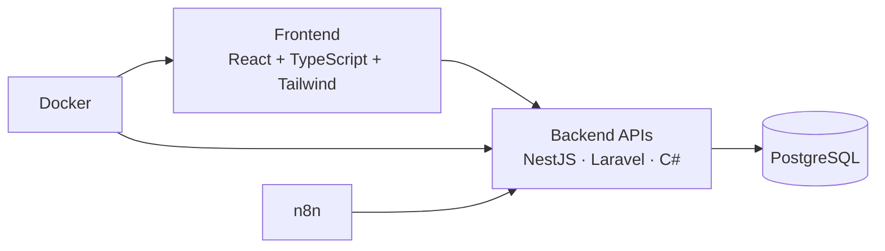

# <h1 align="center">Hola, soy Mauricio Gonzalo Peredo Saracho 👋</h1>

<h3 align="center">
Desarrollador Full-Stack • Docente Universitario • Ingeniero de Sistemas (SIB)
</h3>

Apasionado por la arquitectura de software, la ciberseguridad y la investigación aplicada a la privacidad de datos.

---

## 🚀 Sobre mí

* 🎓 **Docente Universitario** en áreas de desarrollo de software, redes y fundamentos de TI.
* 🔬 **Investigador de Posgrado**, desarrollando una tesis sobre:

  * Soberanía de datos
  * Privacidad Diferencial
  * Aprendizaje Federado
  * Entrenamiento seguro de LLMs
* 🌱 Actualmente construyendo:

  * Plataforma web de educación inclusiva.
  * Integraciones de facturación electrónica para sistemas de gestión.
* 🛡️ Interesado en:

  * Auditoría de redes
  * OSINT
  * Gestión de vulnerabilidades
  * CVSS v4.0
  * Seguridad ofensiva y defensiva

---

## 💼 Áreas de Enfoque

| Área                                | Enfoque |
| ----------------------------------- | ------- |
| 💻 Desarrollo Full-Stack            | 45%     |
| 🎓 Docencia y Mentoría              | 30%     |
| 🔬 Investigación en IA y Privacidad | 15%     |
| 🛡️ Ciberseguridad y Auditoría      | 10%     |

---

## 🛠️ Stack Tecnológico

### Frontend

### Backend

### Bases de Datos

### DevOps & Automatización

---

## 🧠 Arquitectura de Trabajo

---

## 🎯 Líneas de Investigación

* Privacidad diferencial aplicada a LLMs.
* Aprendizaje federado para entornos distribuidos.
* Soberanía y gobernanza de datos.
* Seguridad en arquitecturas de IA.
* Evaluación de riesgos mediante CVSS v4.0.

---

## 📫 Contacto

* 💼 LinkedIn: [*mauricio-gonzalo-peredo-saracho*](https://www.linkedin.com/in/mauricio-gonzalo-peredo-saracho/)
* 📧 Correo: 	mauriciogonzaloperedo28@gmail.com

---

> "La tecnología tiene mayor impacto cuando se construye con seguridad, ética y propósito."
